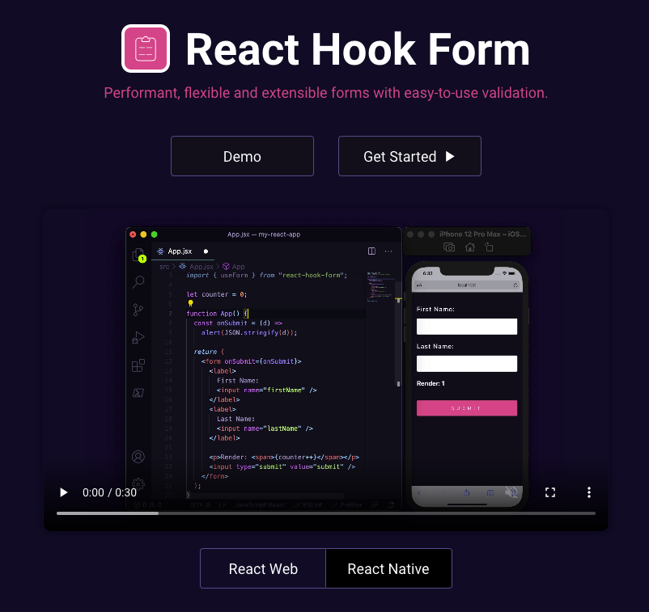

## 리액트에서의 Form UI

사용자 입력 기능을 만들 때,<br />
value, onChange disable 등의 고려할 부분들과 고작 인풋창 하나에 useState가 기본 2개나 생성된다는 점이 비효율 적이게 느껴졌다.

`custom hook`으로 만들어두고 사용하는 것도 하나의 방법이겠으나,<br />
유용한 라이브러리를 발견해 공유하고자 한다 🥳

<!--truncate-->

### 패키지 설치

```
$ npm i react-hook-form
$ yarn add react-hook-form
```



### 특징

일반적인 `form`을 다룰 때 많은 `input`들을 다 `useState`로 관리하고 `change`함수만들고 하는 일은
중복되는 코드들도 많고 번거로운 작업이 많이 들어간다.
`react hook form`은 `value`자체가 필요없고 제공되는 `handlesubmit`함수에서 모든 **`input`값들을 관리할 수 있어서 굉장히 편리하고 효율적인 코드**를 만들 수 있다!

### 장점

- input하나를 관리하기 위해 작성되는, value 상태와 onChange이벤트 등을 직접 작성하지 않고 쉽게 관리할 수 있다
- Submit 클릭 시 필수값 중 작성되지 않은 input으로 focus를 자동으로 이동시켜줌
- 에러처리, validation처리가 매우 편함

### 사용 예시

```typescript
import { useForm } from "react-hook-form";

const ToDoList = () => {
  interface IForm {
    email: string;
    firstName: string;
    lastName: string;
    userName: string;
    password1: string;
    password2: string;
    extraError?: string;
  }

  const {
    register,
    handleSubmit,
    formState: { errors },
    setError,
  } = useForm<IForm>({
    defaultValues: {
      email: "@naver.com",
    },
  });

  const onValid = (data: IForm) => {
    if (data.password1 !== data.password2) {
      // shouldFocus 특정 에러일때 커서가 이동되도록 함
      setError(
        "password1",
        { message: "Password are not the same" },
        { shouldFocus: true }
      );
    }
    // 백엔드 에러라 가정하고, form전체 에러 예제임
    setError("extraError", { message: "Server offline" });
  };

  return (
    <div>
      <form
        style={{ display: "flex", flexDirection: "column" }}
        onSubmit={handleSubmit(onValid)}
      >
        <input
          {...register("email", {
            required: "Email is required",
            pattern: {
              value: /^[A-Za-z0-9._%+-]+@naver.com$/,
              message: "Only naver.com emails allowed",
            },
          })}
          placeholder="Email"
        />
        <span>{errors?.email?.message}</span>
        <input
          {...register("firstName", {
            required: true,
            // validate 조건 추가
            validate: (value) => !value.includes("aa"),
          })}
          placeholder="FirstName"
        />
        <input
          {...register("lastName", { required: true })}
          placeholder="LastName"
        />
        <input
          {...register("userName", { required: true, minLength: 10 })}
          placeholder="UserName"
        />
        <input
          {...register("password1", {
            required: "Password1 is required",
            minLength: {
              value: 5,
              message: "Your password is too short",
            },
          })}
          placeholder="Password1"
        />
        <span>{errors?.password1?.message}</span>
        <input
          {...register("password2", {
            required: "Password2 is required",
            minLength: {
              value: 5,
              message: "Your password is too short",
            },
          })}
          placeholder="Password2"
        />
        <button>Add</button>
        <span>{errors?.extraError?.message}</span>
      </form>
    </div>
  );
};

export default ToDoList;
```

### Tip!

외부 UI라이브러리와 함께 사용하게 될 경우,<br />
등록 프로세스를 처리하는 컨트롤러를 이용하면된다.

```typescript
	...

  return (
    <form onSubmit={handleSubmit(onSubmit)}>
      <Controller
        name="firstName"
        control={control}
        render={({ field }) => <Input {...field} />} // <- UI라이브러리 요소 사용
      />
      <input type="submit" />
    </form>
  );

```
